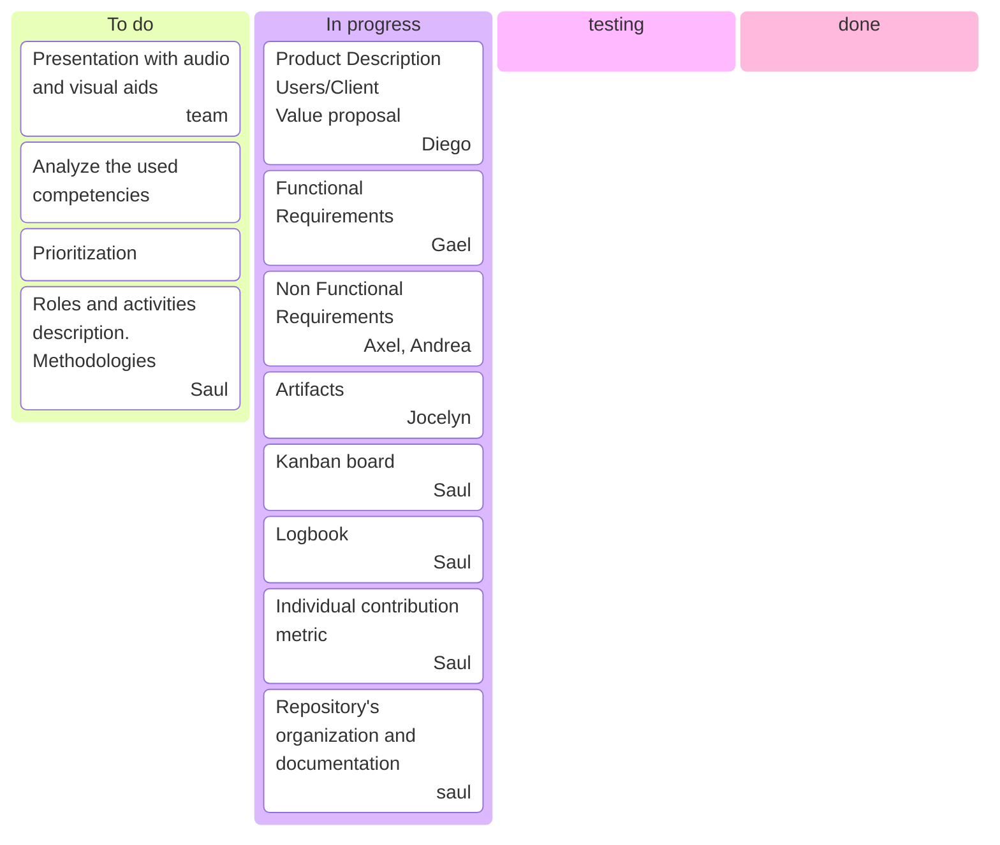
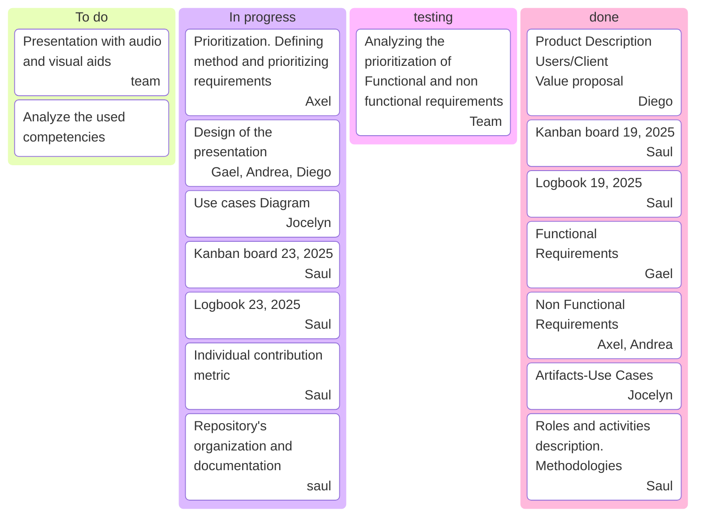
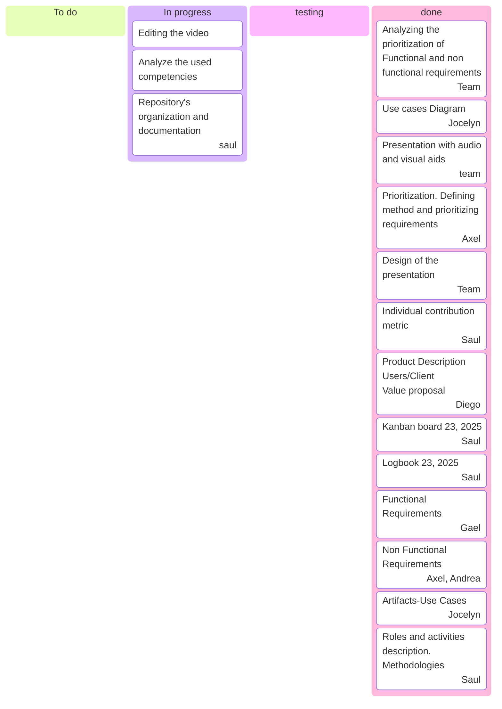
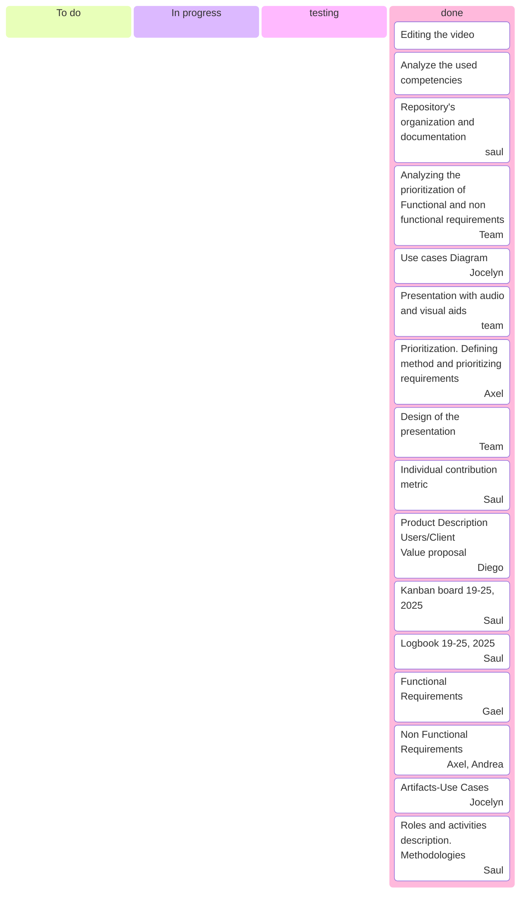

# Process description.

For this project we'll use an agile process flow. For this section we will execute the first two activities of the five process framework (communication, planning,modeling, construction, and deployment).

We apply the SCRUM to the project in the first to activities of Communication and Planning.

In the communication phase we completed the requirements discovery by questioning stakeholders, particularly students, about the features they needed the application to have.
Then we classify this requirements by using the Moscow priorization method.

The MoSCoW method is a requirements priorization technique that has four categories.
M - Must Have.
S - Should Have.
C - Could Have.
W - Won't Have.

### See the Document of Software Requirements Specification in this project for the prioritized requirements. [SRS](./SoftwareRequirementsSpecification.pdf).

For this section of the project we divide the roles as follows:

- Saul Suarez. Planning and organizing team meetings and tasks, documentation of the process and manage the progress of tasks and make adjustments. Redacting the Process Descriptiion, Project Management, and Individual Contributin Measure, and performing in the presentation.
- Diego Alcocer. Product description including redacting the objective, defining the users and redacting the value proposal. Participating in the desing of the presentation and performing in the presentation.
- Jocelyn Lopez. Redacting the specificacion of Use cases and making the diagram of Use Cases. Contributing to the design of the presentation.
- Gael Brito. Redacting the functional requirements, participating in the desing of the presentation, filming and creating the user interface for the sample in the video.
- Axel Cocom. Redacting the product requirements (Usability, Efficiency and Security), and the prioritization method. Participating in the design of the presentation y performing in the presentation.
- Andrea Acosta. Redacting the organizational requirements (Development requirements) and participating in the desing of the presentation. Editing the video and performing in the presentation.

In the next table we show the Individual contribution of each member of the team.

<table>
<tr>
<th>Team member</th>
<th>Product / Artifact</th>
<th>Individual Contribution Measure</th>
<th> Total Indivitual Contribution </th>
</tr>
<tr>
<td rowspan="5">Saul Suarez</td>
<td>Process Description</td>
<td>2.332%</td>
<td rowspan="5">16.6667 %</td>
</tr>
<tr>
<td>Process Management</td>
<td>3.332%</td>
</tr>
<tr>
<td>Documentation</td>
<td>3.332%</td>
</tr>
<tr>
<td>Task Management and adjustment</td>
<td>3.332%</td>
</tr>
<tr>
<td>Performing in the presentation</td>
<td>4.332%</td>
</tr>
<td rowspan="5">Diego Alcocer</td>
<td>Product Description</td>
<td>2.332%</td>
<td rowspan="5">16.6667 %</td>
</tr>
<tr>
<td>User Definition</td>
<td>2.332%</td>
</tr>
<tr>
<td>Value Proposal</td>
<td>3.332%</td>
</tr>
<tr>
<td>Participating in the desing of the presentation.</td>
<td>4.332%</td>
</tr>
<tr>
<td>Performing in the presentation</td>
<td>4.332%</td>
</tr>
<td rowspan="3">Jocelyn Lopez</td>
<td>Specification of Use Cases</td>
<td>6%</td>
<td rowspan="3">16.6667 %</td>
</tr>
<tr>
<td>Diagram of Use Cases</td>
<td>6%</td>
</tr>
<td>Participating in the Design of the presentation</td>
<td>4.666%</td>
</tr>
<td rowspan="4">Gael Brito</td>
<td>Redacting the functional requirements</td>
<td>4.666%</td>
<td rowspan="4">16.6667 %</td>
</tr>
<tr>
<td>Participating in the desing of the presentation.</td>
<td>3%</td>
</tr>
<tr>
<td>Filming</td>
<td>3%</td>
</tr>
<tr>
<td>Creating the user interface for the sample of the video</td>
<td>6%</td>
</tr>
<td rowspan="5">Axel Cocom</td>
<td>Redacting the product requirements (Usability, Efficiency and Security)</td>
<td>4%</td>
<td rowspan="5">16.6667 %</td>
</tr>
<tr>
<td>Redacting the external requirements (Legislative and regulatory)</td>
<td>4%</td>
</tr>
<tr>
<td>Participating in the desing of the presentation</td>
<td>2.666%</td>
</tr>
<tr>
<td>Performing in the presentation</td>
<td>2%</td>
</tr>
<tr>
<td>Redacting and apllying the priorization method</td>
<td>4%</td>
</tr>
<td rowspan="4">Andrea Acosta</td>
<td>Redacting the organizational requirements (Development requirements)</td>
<td>4%</td>
<td rowspan="4">16.6667 %</td>
</tr>
<tr>
<td>Participating in the desing of the presentation.</td>
<td>4%</td>
</tr>
<tr>
<td>Performing in the presentation</td>
<td>2%</td>
</tr>
<tr>
<td>Editing the video</td>
<td>6.666%</td>
</tr>

## Soft Skills.

### Generic soft skills.

- We demonstrate the communication in oral and written english by redacting the documentation and speaking in the presentation video.
- We manage the knowledge by reading and using the books provided for this section of the project.
- We used the information and communication technologies to search for ideas and knowledge for the project.

### Specific Soft Skills.

- We analize the principal methods, procedures and techniques for this project, deciding to use the MosCow Method for priorization of requirements, the kanban board to manage the tasks, the agile methodology and the use of the logbook for the analysis and design of requirements.

</table>

## September 19, 2025

In this date the team create the document of Software Requirements Specification. We specified the requirements, start creating use cases and redacting the product and process description.

The kanban board for september 19, 2025 is shown below.

## September 23, 2025

For this session the team prioritize the requirements and designe the use cases diagram. We analyzed the requirements.

The kanban board for september 23, 2025 is shown below.

## September 24, 2025

For this day the team designe the presentation and create the video. In this stage we analyze the competencies shown in this phase of the project. The video got edited and the documentation redacted.

The kanban board for september 24, 2025 is shown below.

## September 25, 2025

The team verified the completed tasks.

The kanban board for september 25, 2025 is shown below.

