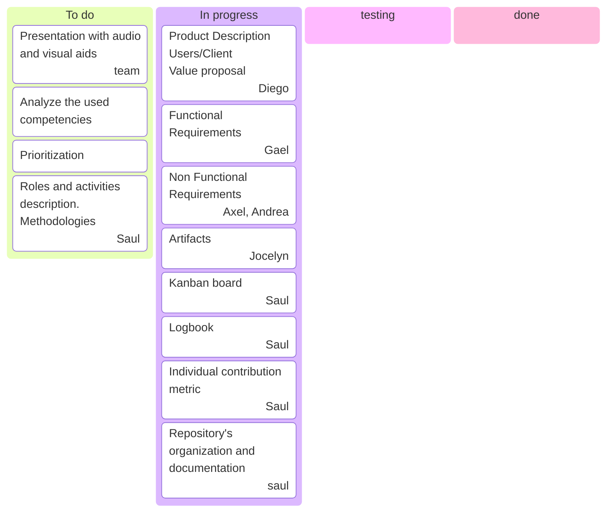

# Process description.

## September 19, 2025

For this section of the project we divide the roles as follows:

- Saul Suarez. Planning and organizing team meetings and tasks, documentation of the process and manage the progress of tasks and make adjustments.
- Diego Alcocer. Product description including redacting the objective, defining the users and redacting the value proposal.
- Jocelyn Lopez. Redacting and making the diagram of Use Cases.
- Gael Brito. Redacting the functional requirements.
- Axel Cocom, Andrea Acosta. Redacting the non functional requirements.

In the next table we show the Individual contribution of each member of the team.

<table>
<tr>
<th>Product/artifact</th>
<th>Team member</th>
<th>Individual Contribution Measure</th>
</tr>
<tr>
<td>Process description, process management, documentation, task management and adjustment</td>
<td>Saul Suarez</td>
<td>16.6667 %</td>
</tr>
<tr>
<td>Product description, user definition and value proposal</td>
<td>Diego Alcocer</td>
<td>16.6667 %</td>
</tr>
<tr>
<td>Redacting and making the diagram of Use Cases</td>
<td>Jocelyn Lopez</td>
<td>16.6667 %</td>
</tr>
<tr>
<td>Redacting the functional requirements.</td>
<td>Gael Brito</td>
<td>16.6667 %</td>
</tr>
<tr>
<td>Redacting the non functional requirements.</td>
<td>Axel Cocom</td>
<td>16.6667 %</td>
</tr>
<tr>
<td>Redacting the non functional requirements.</td>
<td>Andrea Acosta</td>
<td>16.6667 %</td>
</tr>
</table>

The kanban board for september 19, 2025 is shown below.

