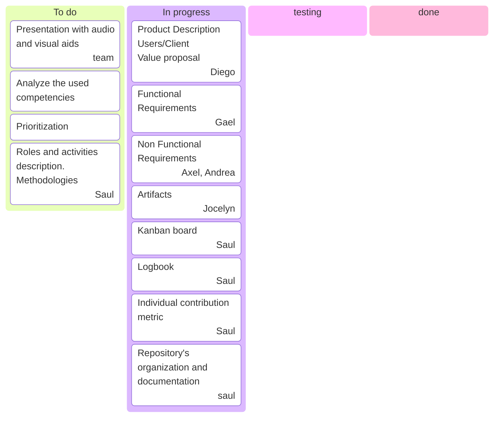
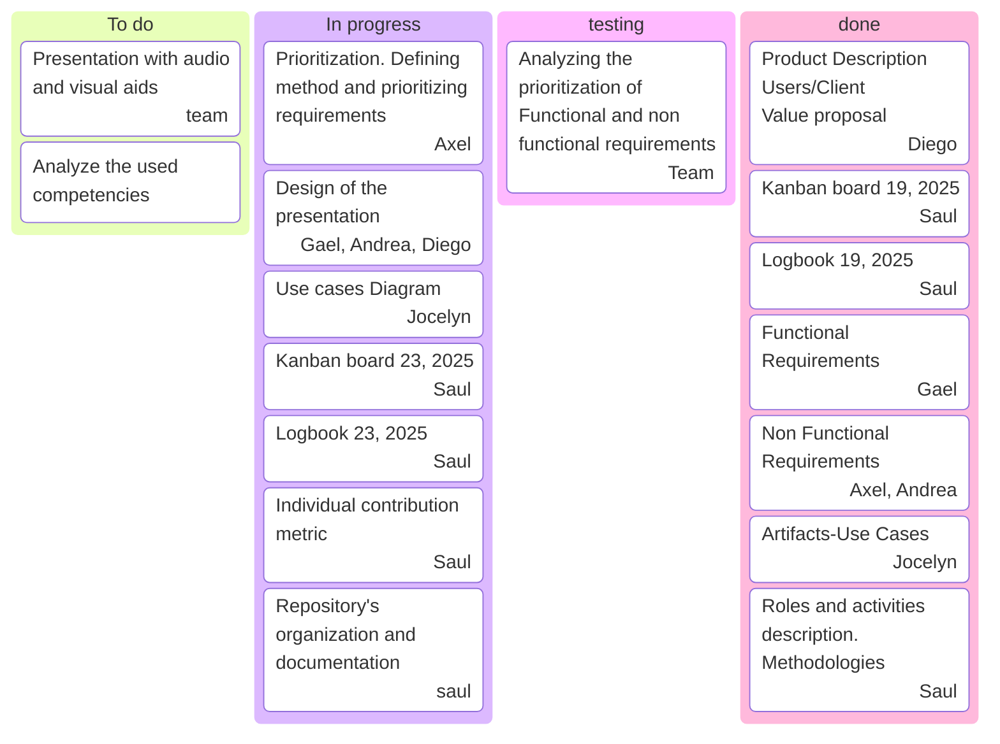

# Process description.

For this project we'll use an agile process flow. For this section we will execute the first two activities of the five process framework (communication, planning,modeling, construction, and deployment).

We apply the SCRUM to the project in the first to activities of Communication and Planning.

In the communication phase we completed the requirements discovery by questioning stakeholders, particularly students, about the features they needed the application to have.
Then we classify this requirements by using the Moscow priorization method.

The MoSCoW method is a requirements priorization technique that has four categories.
M - Must Have.
S - Should Have.
C - Could Have.
W - Won't Have.

See the Document of Software Requirements Specification in this project for the prioritized requirements. [SRS](./Producto.docx).

For this section of the project we divide the roles as follows:

- Saul Suarez. Planning and organizing team meetings and tasks, documentation of the process and manage the progress of tasks and make adjustments.
- Diego Alcocer. Product description including redacting the objective, defining the users and redacting the value proposal.
- Jocelyn Lopez. Redacting and making the diagram of Use Cases.
- Gael Brito. Redacting the functional requirements.
- Axel Cocom, Andrea Acosta. Redacting the non functional requirements.

In the next table we show the Individual contribution of each member of the team.

<table>
<tr>
<th>Team member</th>
<th>Product / Artifact</th>
<th>Individual Contribution Measure</th>
<th> Total Indivitual Contribution </th>
</tr>
<tr>
<td rowspan="4">Saul Suarez</td>
<td>Process Description</td>
<td>4.16%</td>
<td rowspan="4">16.6667 %</td>
</tr>
<tr>
<td>Process Management</td>
<td>4.16%</td>
</tr>
<tr>
<td>Documentation</td>
<td>4.16%</td>
</tr>
<tr>
<td>Task Management and adjustment</td>
<td>4.16%</td>
</tr>
<td rowspan="3">Diego Alcocer</td>
<td>Product Description</td>
<td>4.16%</td>
<td rowspan="3">16.6667 %</td>
</tr>
<tr>
<td>User Definition</td>
<td>4.16%</td>
</tr>
<tr>
<td>Value Proposal</td>
<td>4.16%</td>
</tr>
<td rowspan="2">Jocelyn Lopez</td>
<td>Specification of Use Cases</td>
<td>4.16%</td>
<td rowspan="2">16.6667 %</td>
</tr>
<tr>
<td>Diagram of Use Cases</td>
<td>4.16%</td>
</tr>
<td rowspan="2">Gael Brito</td>
<td>Redacting the functional requirements</td>
<td>4.16%</td>
<td rowspan="2">16.6667 %</td>
</tr>
<tr>
<td></td>
<td>4.16%</td>
</tr>
<td rowspan="2">Axel Cocom</td>
<td>Redacting the product requirements (Usability, Efficiency and Security)</td>
<td>4.16%</td>
<td rowspan="2">16.6667 %</td>
</tr>
<tr>
<td>Redacting the external requirements (Legislative and regulatory)</td>
<td>4.16%</td>
</tr>
<td rowspan="2">Andrea Acosta</td>
<td>Redacting the organizational requirements (Development requirements)</td>
<td>4.16%</td>
<td rowspan="2">16.6667 %</td>
</tr>
<tr>
<td></td>
<td>4.16%</td>
</tr>

</table>

## September 19, 2025

The kanban board for september 19, 2025 is shown below.

## September 23, 2025

The kanban board for september 23, 2025 is shown below.

